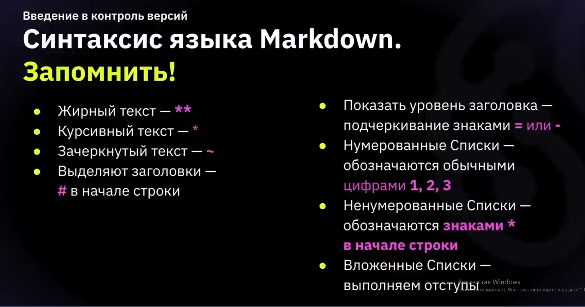

# === Инстуркция Markdown ===

# ===Синтаксис языка Markdown===
*Введение в контроль версий. Работа с Git. Составление инструкции по работе с Git.
Справочник по Markdown от Microsoft:*

https://docs.microsoft.com/ru-ru/contribute/markdown-reference

 # Заголовок – 
 _выделение заголовков. Количество символов “#” задаёт уровень заголовка (поддерживается 6 уровней)._

✦ = или - – подчёркиванием этими символами (не менее 3 подряд) выделяют заголовки первого
(“=”) и второго (“-”) уровней.

# Полужироное
✦ ** Полужирное начертание** или __ Полужирное начертание__

# Курсивное 

✦ *Курсивное начертание* или _Курсивное начертание_ 2 варианта 

# Полужироное курсивное начертание

***Полужирное курсивное начертание***

# Зачеркнутый текст
 ~~Зачёркнутый текст~~
✦ ~~Зачёркнутый текст~~ 

#  Строки
_ненумерованные списки, символ “*” в начале строки_

* 1, 
* 2, 
* 3 … – нумерованные списки

# Изображения
_Чтобы добавить изображение в текст, достаточно напистать следующее:

# Цитаты
здесь что-то должно быть
# Работа с таблицами

# Ссылки 

# Заключение

